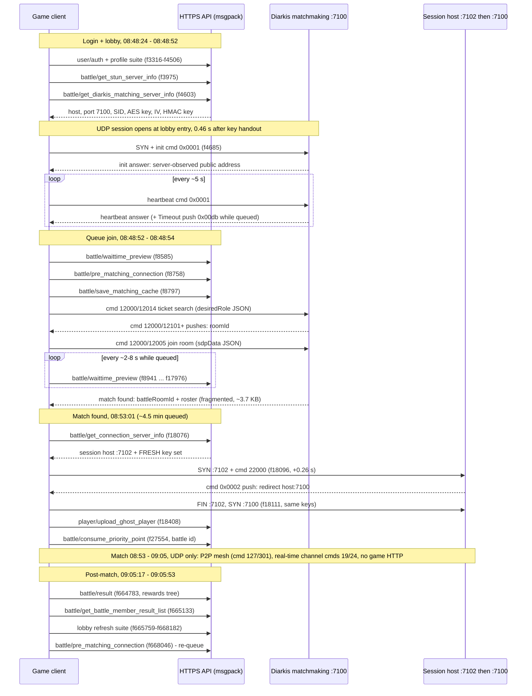

# Matchmaking flow — end-to-end call order

How the HTTP battle calls interleave with the Diarkis UDP session, from lobby
entry through queue-join to match-found. Companion to
[Structure/Diarkis.md](../../Structure/Diarkis.md) (wire protocol) and
[Battle.md](Battle.md) (endpoint reference).

> [!NOTE]
> Transcribed 2026-09-18 from decrypted captures. A TLS keylog captured
> alongside the traffic decrypts the HTTPS layer; HTTP/2 msgpack bodies were
> extracted per call and decoded offline.

## Capture sources

- **`matchmaking data.pcapng`** (primary) — one complete session: login,
  lobby, queue, match found, match, results, re-queue. Frame numbers and
  times below refer to it (times capture-local, -07:00). 101 `/api/` calls
  harvested.
- `once more for breakers and keys.pcapng` — 45-call login/lobby confirmation.
- Non-game noise in the same captures: Discord (`/api/sync/unreads?`,
  `/api/update/win32-x64-user/...`) — excluded below.

## Flow diagram



## Ordered endpoint sequence

### Login and lobby (08:48:24 - 08:48:52)

```text
 1. sys/get_env_v3                         f3316   08:48:24.4
 2. user/auth                              f3333
 3. user/get_country                       f3364
 4. user/get_tracking_num                  f3382
 5. close/get_close_info                   f3480
 6. user/create_user_info                  f3509
 7. adjustment_data_manage/read            f3558   (168 KB blob)
 8. close/get_close_info                   f3788
 9. battle/get_stun_server_info            f3975
10. patroller/get_status                   f4018   \
    gamecurrency/get_owned                 f4070    |
    rival/get_list                         f4132    | profile suite
    avatar_create/get_list                 f4481    |
    character/get                          f4506    |
    character/get_item                     f4555   /
11. battle/get_diarkis_matching_server_info f4603  08:48:34.7  *** UDP keys handed out ***
12. user/get_ban_status                    f4904
    adjustment_data_manage/read            f4965   (second read)
    commonpurchase/get_purchase_status     f5123
    item/item_possession                   f5239
    gamecurrency/get_owned                 f5264
13. battle/get_challenge_list              f5285
    event/get_schedule_list                f5315
14. user/update_manner_point               f5331
    patroller/get_status                   f5360   \ lobby refresh
    ...                                    f5360-5758  (currencies/rival/avatar/character again,
    bnid_reward/grant_reward               f5667    | message/get_message_list,
    regularly_run/get_emergency_message    f5723    | news, lootbox masters)
    lootbox/ticket_master_list             f5758   /
15. leaderboard/get_leaderboard_model      f6630
16. user/update_avatar                     f8371   (127 KB upload)
```

**The Diarkis UDP session opens at lobby entry, before queue join:**
UDP SYN is frame 4685 at 08:48:35.2 — 0.46 s after the key handout (step 11).
Heartbeats (cmd 0x0001) and MatchMaker `"Timeout"` pushes (cmd 0x00db) run
while the client sits in the lobby.

### Queue join (08:48:52 - 08:48:54)

```text
17. battle/waittime_preview                f8585   08:48:52.1
18. battle/pre_matching_connection         f8758   08:48:54.0
19. adjustment_data_manage/get_version     f8772
20. battle/save_matching_cache             f8797
21. season/get_selectable_stage            f8918
22. battle/waittime_preview                f8941   ... polled every ~2-8 s while queued
    (f11746, f12903, f13757, f14407, f15170, f15951, f17303, f17976)
```

Immediately after `pre_matching_connection`, on the already-open UDP session:
cmd 12000 ticket create/search (sub-ID 12014, `desiredRole`/`desiredStageId`
JSON) then join (sub-ID 12005, `roomId` + `sdpData` JSON); server pushes
roomId/battleRoomId updates (cmd 12000, status ff). See
[Structure/Diarkis.md](../../Structure/Diarkis.md#matchmaker-commands).

### Match found (08:53:01, ~4.5 min after queue join)

```text
23. battle/get_connection_server_info      f18076  08:53:01.5  *** session host + port 7102 + FRESH keys ***
    [UDP] SYN host:7102                    f18096  08:53:01.8  (+0.26 s) redirect probe
    [UDP] <- cmd 0x0002 push: beeffeed + "host:7100" endpoint
    [UDP] FIN 7102; SYN host:7100          f18111  08:53:02.1  (+0.63 s) real session
24. player/upload_ghost_player             f18408  (224 B request)
25. battle/consume_priority_point          f27554  (request carries battle id
                                                    "<battleId>_<yyyyMMddHHmmss>")
```

### Match (08:53 - 09:05)

No game HTTP calls during the match — all traffic is Diarkis UDP (session host
+ P2P mesh). Discord noise continues.

### Post-match and re-queue (09:05:17 - 09:05:53)

```text
26. event/get_schedule_list                f664759
27. battle/result                          f664783  09:05:17.2  (1337 B req / 3302 B res, rewards tree)
28. sys/kpi                                f664935  (4154 B telemetry upload)
29. battle/get_battle_member_result_list   f665133  (per-player results; bin8 fields)
30. [lobby refresh suite]                  f665759-666166  (fresh get_diarkis_matching_server_info,
     get_ban_status, adjustment_data_manage/read, commonpurchase, item, currency,
     challenge list, event schedule, update_manner_point, patroller, rival,
     avatar, character, bnid_reward, message list, emergency message,
     3d_model_news, leaderboard)
31. battle/pre_matching_connection         f668046  09:05:53.4  *** re-queue ***
    adjustment_data_manage/get_version     f668055
    battle/save_matching_cache             f668065
    season/get_selectable_stage            f668082
    battle/waittime_preview                f668090
    battle/get_diarkis_matching_server_info f668123, f668145, f668182  (three fresh key sets)
    battle/waittime_preview                f668410
```

## UDP session start relative to HTTP calls

- **Matchmaking server:** SYN 0.46 s after the
  `get_diarkis_matching_server_info` response, at lobby entry — not at queue
  join. The session idles on heartbeats until `pre_matching_connection`.
- **Session host:** SYN to port 7102 0.26 s after the
  `get_connection_server_info` response; the redirect probe (7102) completes
  and the real session (7100) opens 0.63 s after the response.
- Match end is reported over HTTPS (`battle/result`); the UDP session-host
  connection FINs around the same window.

## Rolling session token

**Confirmed**: every response's `session` value is echoed as the next
request's meta `session` across the whole sequence (visible in harvested
msgpack bodies, e.g. request `6a0f55233e251` -> response `6a0f55236b922` ->
next request). [API/Session.md](../Session.md) applies unchanged to the
battle endpoints.

## Endpoints not present in Executable.md

- `battle/waittime_preview`
  — pcap-only; heavily polled during queueing; response is a small integer
  array `[0, 346, 135, 346, 0, 0, 0]` (queue statistics; field meanings TBD).
- `adjustment_data_manage/get_version` — called only in the queue-join block;
  verify against [Executable.md](../../Reverse_engineering/Executable.md).

All other observed endpoints have Executable.md request classes.

---

[Back to document map](../../README.md)
