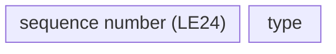
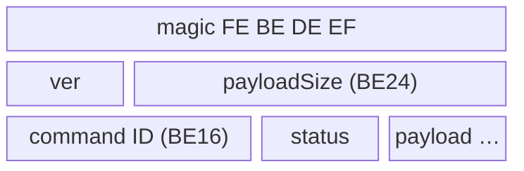
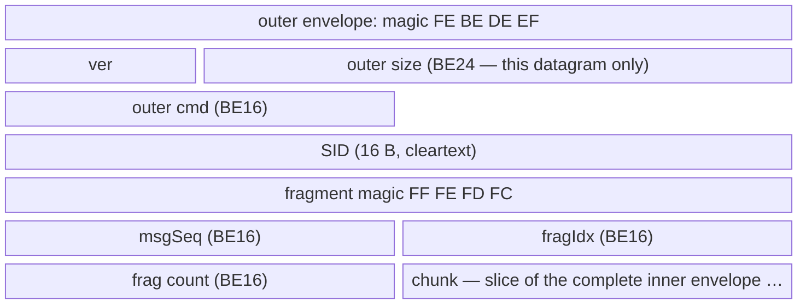
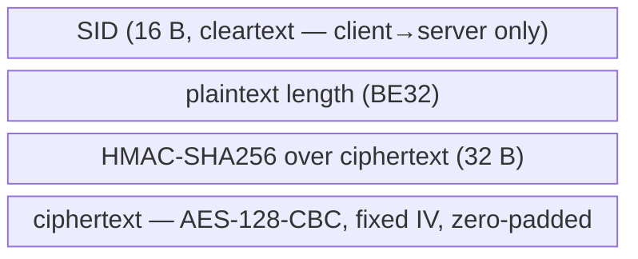
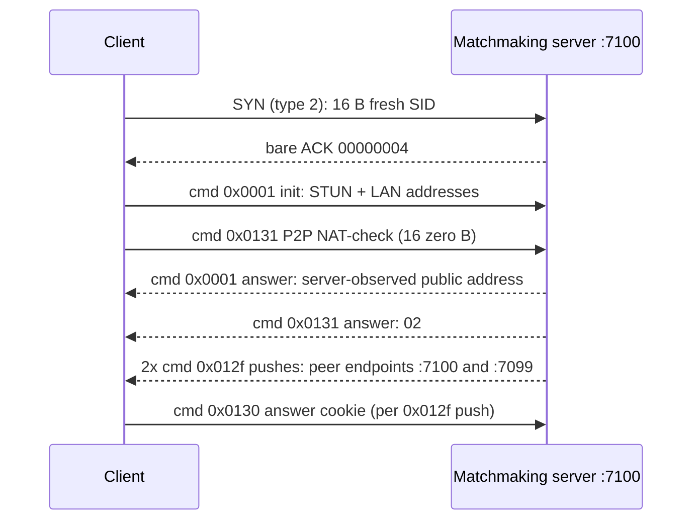
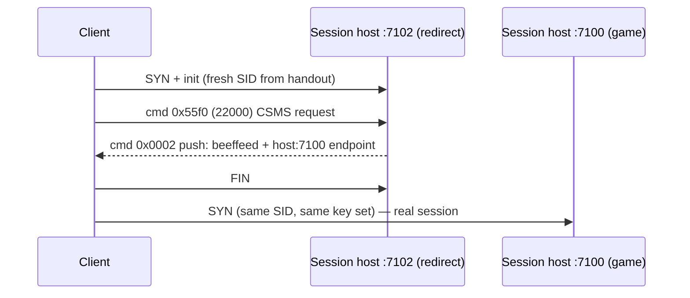

# Diarkis UDP/RUDP wire protocol

The Diarkis protocol carries DBTB matchmaking and in-match coordination over
UDP on port 7100 (plus a port-7102 redirect service on session hosts), using
the endpoint and key material returned by
[battle/get_diarkis_matching_server_info](../API/battle/get_diarkis_matching_server_info.md#subsec:api_battle_get_diarkis_matching_server_info)
or [battle/get_connection_server_info](../API/battle/get_connection_server_info.md#subsec:api_battle_get_connection_server_info).

Facts below are confirmed against `matchmaking data.pcapng` (decrypted
end-to-end 2026-09-18 via a TLS keylog captured alongside the traffic; see
Golden transcripts), the 2026-09-16 structural census of the
`udp 7100 data*.pcapng` captures, and the M4 extension to
`matchmaking data 3.pcapng` + `more matches.pcapng` (45/45 pairable sessions
decrypted with zero fails; all M2 residual decrypt fails were decoder bugs,
none crypto). Frame numbers refer to `matchmaking data.pcapng` unless noted.

## Datagram header

Every RUDP datagram starts with a 4-byte header:

| offset | size | field | notes |
|---|---|---|---|
| 0..2 | 3 | sequence number | little-endian; wraps at 255 -> 256 |
| 3 | 1 | datagram type | see table below |



**Confirmed.** Sequence bytes advance as `00 00 00`, `01 00 00`, `02 00 00`,
... and wrap `ff 00 00` -> `00 01 00` at 255 -> 256. Each direction numbers
its DATs independently from 0.

Types (confirmed by observation except where noted):

| type | name | observed role |
|---|---|---|
| 1 | UNRELIABLE | in-match data and P2P signaling, no ACK; carries the same command envelope as DAT (dominates match traffic) |
| 2 | SYN | session open, 20 B: header + 16-byte session ID |
| 3 | DAT | reliable data, carries a command envelope |
| 4 | ACK | see below |
| 5 | RETRANSMIT | re-send of an unacked DAT (NOT a connection reset) |
| 6 | EACK | reserved; never observed in any decrypted session (48 sessions). Named source: Ghidra RUDP transport code / future captures |
| 7 | FIN | teardown, 20 B: header + 16-byte session ID |

ACK formats — **confirmed**, asymmetric by side:

- Server ACKs are always bare 4 bytes: `<3-byte seq><04>` echoing the acked
  DAT's sequence. The SYN is answered with `00000004`.
- Client ACKs are N 20-byte records (N = 1..17 observed), each record
  `<3-byte seq><04><16-byte session ID>`. "Batched" ACKs are concatenated
  records, each with its own 4-byte header (e.g. a 40 B datagram acks two
  sequences — frame 9020).

Retransmission — **confirmed**: type 5 carries the original command envelope
of an unacked DAT (original sequence number, identical payload) and is sent
every 0.5 s. The udpstream.txt label "5 - retry" was correct; the earlier
"RST" interpretation was wrong.

FIN / teardown — **confirmed**: the FIN's sequence field carries the sender's
*next* DAT sequence (last DAT seq + 1), and the answering bare ACK carries the
*answerer's* next DAT sequence. If a client DAT is still unacked when the FIN
arrives, the server acks it separately first, then the FIN.

The 5×-burst duplication seen in captures is specific to the 0c0c directory
protocol (below) — RUDP DATs are NOT multi-blasted; reliability is via
type-5 retransmission (some capture files additionally contain interface-level
duplicate frames, which are not protocol behavior).

## Command envelope

Type-1, type-3 (and type-5) datagram bodies carry a command envelope:

| offset | size | field | notes |
|---|---|---|---|
| 0..3 | 4 | magic | `FE BE DE EF` |
| 4 | 1 | version | 0 or 1 observed |
| 5..7 | 3 | payloadSize | big-endian; counts the payload only |
| 8..9 | 2 | command ID | big-endian |
| 10 | 1 | status | **server->client only** — 01 OK / 04 BAD / ff push |
| 11 (10).. | payloadSize | payload | starts at byte 11 s->c, byte 10 c->s |



**Confirmed.** Client headers are 10 B, server headers 11 B; payloadSize counts
the payload after the header (excluding the status byte). Status values
observed: `01` = OK, `04` = BAD (3 envelopes across 2 streams — `matchmaking
data 3.pcapng` streams 190 and 690 — all cmd 0x000b `"Missing room ID"`
responses), `ff` = push/asynchronous (very common; no request being
answered). `05` = ERR never observed.

Maximum envelope payload is ~1300 B per datagram; larger messages are
fragmented. **Confirmed** fragment layouts, one per direction.

Server->client — the whole datagram body is a fragment header + chunk:

| offset | size | field | notes |
|---|---|---|---|
| 0..3 | 4 | fragment magic | `FF FE FD FC` |
| 4..5 | 2 | msgSeq (BE16) | packed with fragIdx in one big-endian u32 |
| 6..7 | 2 | fragIdx (BE16) | see msgSeq |
| 8..9 | 2 | fragment count | big-endian |
| 10.. | n | chunk | slice of the complete command envelope |

Client->server — fragments are wrapped in an outer envelope whose size covers
**this datagram only**; the outer payload is:

| offset | size | field | notes |
|---|---|---|---|
| 0..15 | 16 | SID | cleartext |
| 16..19 | 4 | fragment magic | `FF FE FD FC` |
| 20..21 | 2 | msgSeq (BE16) | packed with fragIdx in one big-endian u32 |
| 22..23 | 2 | fragIdx (BE16) | see msgSeq |
| 24..25 | 2 | fragment count | big-endian |
| 26.. | n | chunk | slice of the complete inner envelope |



(Schematic — row widths are not byte-proportional; exact offsets in the
tables above.)

Concatenating chunks in index order reassembles a complete inner command
envelope. **Verified end-to-end** on both directions: client frames
8816/8817 (inner cmd 0x2ee0, inner payloadSize 1492, decrypts and
HMAC-validates) and 14 server fragment groups (up to 3727 B, msgSeq 0..13),
all in the matchmaking session below.

## Crypto envelope

The command-envelope payload is a crypto envelope:

| offset c->s | offset s->c | size | field |
|---|---|---|---|
| 0..15 | — | 16 | SID (cleartext; server->client has no SID prefix) |
| 16..19 | 0..3 | 4 | plaintext length, big-endian (excludes padding) |
| 20..51 | 4..35 | 32 | HMAC-SHA256 over the **ciphertext only** |
| 52.. | 36.. | n | ciphertext = AES-128-CBC(aes_key, fixed IV, zero-pad(plaintext)) |



(Schematic — row widths are not byte-proportional; exact offsets in the
table above.)

**Confirmed by full-session decryption** (2026-09-18): every encrypted packet
in both matchmaking-server and session-host sessions HMAC-validates and
decrypts to structured plaintext (401-line and 2474-line golden transcripts;
see Golden transcripts).

- Fixed key and fixed 16-byte IV per session; **no per-packet IV**
  (decrypting with the session IV yields valid content from byte 0; a wrong IV
  corrupts only block 1 — the classic CBC signature). `RUDPserver.py`'s
  decryptData, which treats bytes 32:48 as a per-packet IV, is wrong; do not
  copy it.
- Padding: zero bytes, always 1..16 of them — ciphertext length is always
  `16 * (len//16 + 1)`, i.e. a full extra block when already aligned
  (len=0 -> 16 B ct; len=53 -> 64 B ct). The 4-byte length excludes padding.
- The 16-byte cleartext SID prefix appears on client->server packets only and
  always equals the session ID from the type-2 SYN.
- ver=1 commands with empty payload (e.g. cmd 0x0131 at bootstrap) carry
  length field 0 with a 16-byte ct block whose decrypted content is
  structurally zero/insignificant.
- **M4 correction:** a zero length field does NOT imply empty content —
  cmd 0x0130 carries 11-12 meaningful bytes under length 0
  (f4826/f4839), and cmd 0x0018 sometimes encrypts 4 content bytes beyond
  the declared length (f18127/f18361: declared 104, real 108). Decoders
  must trust the HMAC, not the declared length, when deciding validity
  (fixed in the project's private decoder; these were the M2 residual
  "decrypt fails" — decoder bugs, not crypto).

### Key roles

**Confirmed positionally** from decrypted `get_diarkis_matching_server_info`
responses paired with their UDP sessions (same capture, matched by
reversed-IP hostname + timestamp):

| response array position | wire role |
|---|---|
| `[1][0]` | endpoint hostname (reversed-IP `.bc.googleusercontent.com`) |
| `[1][1]` | UDP port (7100 matchmaking / 7102 session-host redirect) |
| `[1][2]` | 16-byte session ID (SID): body of the type-2 SYN; prepended cleartext to every client->server DAT; echoed in client ACK records |
| `[1][3]` | AES-128-CBC key |
| `[1][4]` | AES-128-CBC IV (fixed) |
| `[1][5]` | HMAC-SHA256 key, over ciphertext only |

The leading `0` in the response data array and the `[1, 1]` tail are constants
across the five decrypted `get_diarkis_matching_server_info` responses in the
baseline capture (the sixth baseline handout, `get_connection_server_info`,
has no tail; 37 handout responses observed in total with M4) — `0` = endpoint
result code, resolved M3; `[1, 1]` type resolved, semantics open — see
Remaining unknowns.
`get_connection_server_info` uses the same layout minus the `[1, 1]` tail.

unpackmsg.py's labels are swapped: its `udpIV` is the SID and its `sid` is the
AES IV (`udpKey`/`hashKey` were already correct).

### Key rotation

**Confirmed: keys are per-session random.** The five
`get_diarkis_matching_server_info` responses in `matchmaking data.pcapng` each
carry a fresh four-value set, and each new UDP session SYNs with the matching
fresh SID. Consequence for the custom server: the HTTP endpoint must generate
each key set at runtime and share it with the UDP server process.

Coverage: sessions in the matchmaking and gameplay captures taken with SSLKEYLOGFILE
enabled (`matchmaking data.pcapng`, `matchmaking data 3.pcapng`,
`more matches.pcapng` and others) are decryptable
via the captured TLS keylog (kept in the private evidence vault). The three
`udp 7100 data*.pcapng` files contain no TLS handshakes; their sessions remain
undecryptable unless their keys surface elsewhere.

## Session bootstrap

**Confirmed** by full decryption (matchmaking server session, frames
4685-4905, client `192.168.1.10:55555` -> `203.0.113.34:7100`; both
addresses and the port are doc placeholders — see note under Golden
transcripts):

1. C->S SYN (type 2, 20 B): `00000002` + 16-byte fresh random SID.
2. S->C bare ACK: `00000004`.
3. C->S init DAT, cmd 0x0001 ver 0. Decrypted plaintext (53 B):

   ```text
   [4-byte token][a0 01 00 00]            8-byte prefix (token varies per packet; a0010000 constant)
   u32be(19) "203.0.113.100:55555"        STUN/public address (ASCII; doc placeholder)
   u32be(18) "192.168.1.10:55555"         LAN address (ASCII; doc placeholder)
   ```

4. C->S cmd 0x0131 ver 1 (P2P NAT-check), length field 0, plaintext 16 zero
   bytes.
5. S->C init answer, cmd 0x0001 ver 0 status 1; 26-byte plaintext:
   `01` + the 4-byte token echoed + `a0 01 00 00` + the client's
   **server-observed** public address as unprefixed ASCII
   (`"203.0.113.7:55555"` placeholder — note this differs from the client's
   STUN claim; the server reports what it actually sees).
6. S->C cmd 0x0131 ver 1 status 1, 1-byte plaintext `02`.
7. S->C two cmd 0x012f pushes (status ff): ASCII endpoint strings,
   `3.113.0.203.bc.googleusercontent.com:7100` and the same host on `:7099`
   (43-byte plaintexts = u16 length + ASCII; hostname is a same-length doc
   placeholder).
8. C->S cmd 0x0130 ver 1, once per 0x012f push — an 11-12 B answer cookie
   under a zero length field (see P2P bootstrap probes); the session
   then carries matchmaking traffic (cmd 0x2ee0) and heartbeats.



## Session-host redirect service (port 7102)

**Confirmed** (frames 18096-18110). In the baseline capture,
`get_connection_server_info` handed out the session host on **port 7102**;
that port runs a redirect probe, not the game session (the handout port
varies — 7100 or 7102 across ten captured responses; see "Session-host
redirect — updated" below):

1. C->S SYN + init (same bootstrap as above, fresh SID from the handout).
2. C->S cmd 0x55f0 (22000) ver 1 — CSMS-framed request (see MatchMaker).
3. S->C cmd 0x0002 ver 0 status ff, 49-byte plaintext:
   `be ef fe ed` + ASCII `"249.113.000.203.bc.googleusercontent.com:7100"`
   (same-length doc placeholder — reversed form of RFC 5737 `203.0.113.249`,
   leading zero preserves the captured string length).
4. Client FINs the 7102 probe and immediately SYNs the same host on **7100**
   (same SID — the key set carries over) — the real session.

M4 update: the redirect is **bidirectional** (7100↔7102 both ways) and some
sessions need no redirect — see "Session-host redirect — updated" below.



## 0c0c directory service

**Confirmed**: a separate lightweight cleartext protocol on the same port —
these packets have NO RUDP datagram header and are NOT encrypted (frames
4828-4876):

```text
query (C->S, 26 B):   0000 0c0c 00000001 0010 <16-byte session SID>
answer (S->C, 51 B):  0f0f 0c0c 00000001 0029 "3.113.0.203.bc.googleusercontent.com:7100"

[0..1]  flag: 0000 or 0f0f
[2..3]  command: 0x0c0c (directory)
[4..7]  constant 00000001
[8..9]  payload length, 2-byte big-endian
[10..]  payload: SID (query) / ASCII "<reversed-ip>.bc.googleusercontent.com:7100" (answer)
```

(The answer's hostname above is a same-length doc placeholder — reversed form
of RFC 5737 `203.0.113.3`; the 51-B total and `0029` = 41 payload length are
preserved exactly.)

Both sides transmit in **5× identical bursts**; rounds repeat on a ~1.0 s
cadence. The flag flips after the first exchange (client `0000` -> `0f0f`,
server `0f0f` -> `0000`). Flag semantics unresolved (cleartext protocol, so
no key material is involved) — named source: Ghidra, the client-side 0x0c0c
directory sender/receiver (see Remaining unknowns). The directory answer and the
cmd 0x012f pushes steer the client to the same peer host. The client probes
every candidate server while holding a full RUDP session with its chosen one.
M4 confirmation: the M4 captures add 30 cleartext DIR-probe streams (20-30
packets each, no SYN, no encryption) carrying the *sibling* matchmaking
host's session SID — e.g. `matchmaking data.pcapng` stream 45 (peer
`203.0.113.3:7100` — doc placeholder, frames 4828-5091) is 30 such probes
carrying stream 43's
SID; it contains no RUDP session and no encrypted traffic at all (NAT /
endpoint discovery against a second frontend while the real session runs
elsewhere).

## Heartbeat and teardown

**Confirmed** on the decrypted matchmaking session (see Golden transcripts);
re-measured across all 48 M4 sessions:

- Heartbeat is the cmd 0x0001 ver 0 pair on the established session, every
  ~5.0 s (stream 43: 53 beats, median 5.026 s, min 4.90, max 5.08; session
  host: 153 beats, median 5.010 s). Client plaintext is 8 B —
  `u32le millisecond counter` + `a0 01 00 00`; the counter advances ≈ +5000 ms
  per beat (measured mean 5027 ms, min 5002, max 5077). Server replies with
  26 B — `01` + the counter echoed + `a0 01 00 00` + the observed public
  address (same shape as the init answer).
- While queued on the matchmaking server, the server additionally pushes cmd
  0x00db (219) ver 1 status ff every ~5 s, payload the ASCII string
  `"Timeout"` (7 B). 46 pushes on stream 43; 186 across the M4 captures;
  `"Timeout"` is the only payload ever observed. Never sent by session hosts.
- ACK piggybacking: client ACK datagrams may carry a tail of extra
  `(3 B LE seq + 04 + 16 B SID)` records — multi-ACKs in one datagram
  (e.g. f18032 stream 43 acks seq 0x83-0x89 at once (7 sequences)).
- Teardown: client FIN (type 7, 20 B) -> server bare ACK; sequence
  relationship documented under Datagram header.

## Command census

**Confirmed** (M4, 2026-09-18): every command envelope in all 48 decrypted
sessions decrypts and HMAC-validates with the project's private decoder
(3 sessions in `matchmaking data.pcapng`; 45 in `matchmaking data 3.pcapng` +
`more matches.pcapng`; zero DECRYPT-FAIL / NO-MAGIC). One further session
(`matchmaking data 3.pcapng` UDP stream 17) is undecryptable — its handout
predates keylog coverage. Counts below are totals across all 48 sessions;
frame refs are `matchmaking data.pcapng` unless another capture is named.

| cmd dec | hex | dir (status) | n | payload kind | role |
|---|---|---|---|---|---|
| 1 | 0x0001 | c→s / s→c (01) | 1791 / 1791 | raw | init + heartbeat (see Session bootstrap, Heartbeat) |
| 2 | 0x0002 | s→c (ff) | 5 | `beeffeed` + ASCII endpoint | session-host redirect push (bidirectional, see below) |
| 11 | 0x000b | c→s / s→c (01, **04**) | 50 / 50 | empty / N×(u32be 18 + uid) | room member-list poll; error path `"Missing room ID"` |
| 14 | 0x000e | s→c (ff) | 4 | u32be 18 + uid | member-joined / last-one-out notice |
| 19 | 0x0013 | c→s / s→c (ff) | 752 / 5216 | 26/25 B per-player record | in-match relayed player-state (see P2P) |
| 24 | 0x0018 | c→s / s→c (ff) | 4574 / 5188 | 104 B / 25 B | in-match relay (c→s addressed per recipient) |
| 101 | 0x0065 | s→c (01) | 7 | u32 + 52-char room GUID | room create/join response |
| 102 | 0x0066 | c→s / s→c (01, ff) | 10 / 60 | GUID+uid / "OK", uid pushes | room attach + leave + member-left notices |
| 103 | 0x0067 | c→s / s→c (ff) | 23 / 60 | `01`+GUID+16 B ID / u32be 17+16 B ID+1 B | member-ID registration and distribution |
| 104 | 0x0068 | c→s / s→c (ff) | 164k / 1.21M | property bag / relay envelope | property sync **and** the bulk in-match message channel |
| 115 | 0x0073 | c→s / s→c (01) | 3 / 3 | GUID + userName + 100 B JSON / "OK" | identity/rule exchange |
| 127 | 0x007f | c→s / s→c (ff) | 3 / 13 | 1 B `00` / 784 B mesh | P2P mesh init + ack |
| 219 | 0x00db | s→c (ff) | 232 | ASCII `"Timeout"` | matchmaking-queue keepalive push |
| 301 | 0x012d | c→s | 66 | 16 zero bytes | P2P-established report (one per peer) |
| 302 | 0x012e | — | **0** | — | relay request: **never observed** (see Remaining unknowns) |
| 303 | 0x012f | s→c (ff) | 71 | u16be len + ASCII endpoint | server-advertised candidate endpoints |
| 304 | 0x0130 | c→s | 41 | 11-12 B cookie (len field 0) | endpoint-push answer cookie |
| 305 | 0x0131 | c→s / s→c (01) | 2 / 2 | 16 zero B / 1 B `02` | NAT check at bootstrap |
| 12000 | 0x2ee0 | c→s / s→c (01, ff) | 70 / 274 | CSMS + msgpack | **MatchMaker** (custom; see below) |
| 22000 | 0x55f0 | c→s / s→c (01, ff) | 23 / 141 | CSMS + msgpack | **connection-room** commands (custom; see below) |

Public Diarkis command IDs **not** observed anywhere: MM 218-229 (except the
219 "Timeout" push repurposed as queue keepalive), Room 100/105-135, P2P 302.
Do not implement the public ticket sequence — the actual flow is below.

## Custom command framing (CSMS) — cmds 12000 / 22000

**Confirmed byte-exact** on all 48 CSMS messages of the baseline sessions and
re-verified across the M4 captures. Both custom commands share one framing;
offsets are relative to plaintext start.

Client→server (e.g. f8816, f8982, f9036, f9050, f18016):

```text
[0:4]   "CSMS"
[4:6]   "09"                        ASCII protocol version
[6:9]   ".01"
[9:14]  5 zero bytes
[14:32] 18-digit ASCII user ID      (e.g. "100000000000000001" — doc placeholder)
[32:46] 14 zero bytes               (== 20-char UID slot, NUL-padded, + 12 zeros)
[46:50] u32be = 24 (0x18)           hardcoded constant c→s (serializer
                                    FUN_1405297b0 emits it unconditionally;
                                    Ghidra, inferred). This is the protocol's
                                    payload-length slot — only the server
                                    fills it (s→c); the client stubs it to 24
                                    and its own parser (FUN_140528f80) never
                                    uses the value
[50:54] u32be sub-ID
[54:]   msgpack map {title_cd, platform, user_id, id, data}
```

Server→client **response** (status 01; f8848, f9004, f9062, f9065, f18023):

```text
[0:4]   "CSMS"
[4:6]   u16be platform              BINARY (not ASCII) — platform of the player
                                    whose UID is in the header; verified against
                                    roster userData.platform for all 8 players
                                    (3 = Steam, 1 and 4 = console platforms)
[6:9]   ".01"
[9:14]  5 zero bytes
[14:32] 18-digit ASCII user ID
[32:46] 14 zero bytes
[46:50] u32be = exact byte length of the msgpack map that follows
[50:54] u32be sub-ID
[54:]   msgpack map {id, data}
```

Server→client **push** (status ff; f8840, f9003, …): one extra prefix field:

```text
[0:4]   u32be = total plaintext length minus 4
[4:]    exactly the response layout above
```

Notes:

- The msgpack `id` field always equals the header sub-ID (c→s encodes it
  `cd <u16>` or `d2 <u32>`; s→c always `d2 <u32>`).
- `data` is a JSON **string** (double-encoded); `sdpData` / `roomData` /
  `userData` inside it are themselves JSON strings (triple-encoded).
- c→s requests carry `{title_cd:"025348", platform:3, user_id, id, data}`.
- Response sub-ID = request sub-ID + 1000 (12000→13000, 12005→13005, …;
  22001→23001, 22002→23002, …).
- On roster pushes the header UID is the player whose join/update triggered
  the broadcast, and the binary platform u16 matches that player.

## MatchMaker — cmd 12000 (0x2ee0) sub-IDs

**Confirmed.** DBTB matchmaking rides this custom command, not the public
Diarkis ticket flow. All `data` JSON key lists below are complete for the
observed samples; the full pretty-printed dumps are kept in the project's
private evidence vault together with the golden transcripts.

Client→server:

| sub-ID | hex | n | data JSON keys | meaning |
|---|---|---|---|---|
| 12000 | 0x2ee0 | 8 | gameRule, userName, userRank, userRivalRank, appVersion, blockList[], sdpData{…}, natType, userIp, platformUserId, diarkisNatType | **ticket/room create** — registers the matchmaking room (f8816; `matchmaking data 3.pcapng` f1568438) |
| 12001 | 0x2ee1 | 7 | roomId, roomKey, userName, userRank, userRivalRank, blockList[], sdpData{…}, appVersion, natType, userIp, resultList[], platformUserId, isInvite, diarkisNatType | **join an existing room** (rematch/invite path; m34 stream 1377 f1567850) |
| 12002 | 0x2ee2 | 11 | roomId | **room keepalive** while queued (m34 f1567894) |
| 12005 | 0x2ee5 | 16 | roomId, userId, userData, sdpData{…} | **join room / member-data update** (f9036, f18016) |
| 12012 | 0x2eec | 15 | desiredRole, desiredStageId | **search preferences** (desiredRole 20 = Raider requested, "unselected" stage; f8982, m34 f1567885). This is the search sub-ID — the M2 note saying 12014 was wrong |
| 12017 | 0x2ef1 | 8 | roomId | **ticket complete** — "done searching, assemble battle room" (f9050) |

`sdpData` keys: player_level, p2p_room_id, p2p_uid, platform, pf_uid
(SteamID64 on platform 3), patroller_name, account_name, able_rematch,
prac_update (plus prac_nocd/prac_rule/prac_bot in connection-room contexts).

Server→client responses (status 01, `data` always starts `"status":0`):

| sub-ID | hex | answers | extra keys |
|---|---|---|---|
| 13000 | 0x32c8 | 12000 | roomId, roomData (JSON `{"gameRule":0}`), roomKey (e.g. `"12345678"` — doc placeholder) |
| 13001 | 0x32c9 | 12001 | (status only in observed samples) |
| 13002 | 0x32ca | 12002 | (status only) |
| 13005 | 0x32cd | 12005 | (status only) |
| 13012 | 0x32d4 | 12012 | (status only) |
| 13017 | 0x32d9 | 12017 | **battleRoomId** (e.g. `Aa0Aa0Aa0Aa0Aa0A` — doc placeholder) |

Server→client pushes (status ff):

| sub-ID | hex | n | data JSON keys | meaning |
|---|---|---|---|---|
| 12101 | 0x2f45 | 30 | roomId, roomOwnerUserId, roomMemberList[{userId,userData,sdpData}], total, serial | **matchmaking-room roster** broadcast |
| 12102 | 0x2f46 | 112 | battleRoomId, roomOwnerUserId, roomMemberList[{userId,userData,sdpData}], total, serial | **battle-room roster** broadcast; grows 1→8 as players join; header UID/platform = triggering member |
| 12105 | 0x2f49 | 8 | roleList[8×{userId,role}], battleRoomId, stageId ("1000"), patrollerPriorityPoint, rivalPriorityPoint | **role assignment** — role 0 = Raider, role 1 = Survivor (f18014) |
| 12116 | 0x2f54 | 1 | (single occurrence) | unknown — named source: future captures / Ghidra MM push handler |
| 12118 | 0x2f56 | 8 | roomId | matchmaking-room lifecycle notice (after battleRoomId issued) |
| 12119 | 0x2f57 | 8 | connectionRoomId, serverIp, serverPort | **connect-to-battle instruction** (caveat below) |
| 12120 | 0x2f58 | 15 | roomId | room-created / room-closed notice |

12119 caveat (**confirmed**, f18074): its `serverIp:serverPort`
(`203.0.113.99:80` — doc placeholder for the captured GCP address) is **not**
the transport the client actually uses — the
real session host came via HTTPS `battle/get_connection_server_info` + the
port-7100/7102 redirect. Treat 12119 as "battle ready + connection-room
binding", not a transport address.

Server-side role assignment differs from the request: the local client always
sends desiredRole 20, but the server's echo of its own profile says
desiredRole **11** (m34 streams 1377/2216), and the 12105 roleList is
authoritative.

## Ticket flow as observed

**Confirmed** (stream 43, `matchmaking data.pcapng`; t = seconds since SYN
f4685). This replaces any public-Diarkis ticket sequence:

1. **f8816** t=19.45 c→s 12000/**12000** (the only fragmented c→s message seen:
   2 frags, reassembled 1502 B): create matchmaking room/ticket with profile +
   blockList + sdpData.
2. **f8840** t=19.70 push **12120** `{roomId}` — room exists.
3. **f8848** t=19.78 resp **13000** `{status:0, roomId, roomData, roomKey}`.
4. **f8982** t=20.46 c→s 12000/**12012**: search prefs (desiredRole 20).
5. **f9003** t=20.59 push **12101** matchmaking-room roster (1 member);
   **f9004** resp **13012** `{status:0}`.
6. **f9036** t=20.72 c→s 12000/**12005**: join room (roomId + sdpData).
7. **f9050** t=20.74 c→s 12000/**12017**: `{roomId}` — complete.
8. **f9060** push 12101; **f9062** resp **13005**; **f9063** t=20.82 push
   **12102**: battleRoomId created, roster = self; **f9065** resp **13017**
   `{status:0, battleRoomId}`.
9. **f9088** t=20.90 push **12118** `{roomId}` — matchmaking room superseded.
10. Queue (~2.5 min here): heartbeats + cmd-219 "Timeout" pushes only; queued
    sessions also send periodic 12002 room keepalives (M4 captures).
11. Battle room fills — one **12102** push per joining player (header UID =
    that player; f14563, f14883, f15257, f15482, f15866, f16632, f18010).
12. **f18014** t=265.16 push **12105** roleList (Raider + 7 Survivors) +
    stageId.
13. **f18016** c→s 12000/12005 re-join/update (`able_rematch:false`);
    **f18023** resp 13005.
14. **f18019-f18068**: eight **12102** pushes, full 8-member final roster, one
    keyed to each member (~3.6 KB each, fragmented ×3).
15. **f18074** t=266.27 push **12119**: connection-room binding (see caveat).
16. Client FINs the matchmaking session (f18416) and opens the session-host
    flow (below). The HTTPS `battle/get_connection_server_info` call happens
    between the match-found burst and the FIN.

The **match-found burst** = steps 11-15: the 12102 roster series, the 12105
role assignment, the final eight 12102 pushes, and 12119. Roster entries carry
`userData{userName,userRank,userRivalRank,desiredRole,desiredStageId,platform}`
and `sdpData{…}` (keys above).

## Connection room — cmd 22000 (0x55f0) sub-IDs

**Confirmed** (7102 redirect probe + session host; streams 162/163 plus 9
session-host flows in the M4 captures). Same CSMS framing as 12000.

| sub-ID | hex | dir/status | data JSON keys | meaning |
|---|---|---|---|---|
| 22000 | 0x55f0 | c→s | connectionRoomId | connection-room attach (variant of 22001) |
| 22001 | 0x55f1 | c→s | connectionRoomId | **join connection room** — sent even to the 7102 redirect probe (f18102) |
| 22002 | 0x55f2 | c→s | roomId, isInterrupted, turnState, turnReason, usertList[7×{userId,holePunchingState,rttAtConnectionCheck,rttAtBattleEnd}] | **end-of-match report / leave** with per-peer RTT (ms). turnState/turnReason: (0,0)+isInterrupted=1 aborted lobby, (1,1), (2,2) completed match (`matchmaking data 3.pcapng` stream 1475 f2143392) |
| 22004 | 0x55f4 | c→s | connectionRoomId + sdpData with prac_update/prac_nocd/prac_rule/prac_bot | practice-flags attach variant |
| 23000 | 0x59d8 | s→c 01 | status | 22000 answer |
| 23001 | 0x59d9 | s→c 01 | status, **diarkisRoomId** (52 hex chars) | 22001 answer — the room GUID used by cmds 101/102/103/104/24 (f18117) |
| 23002 | 0x59da | s→c 01 | status | 22002 answer (f664670) |
| 23004 | 0x59dc | s→c 01 | status | 22004 answer |
| 22100 | 0x5654 | s→c ff | status, roomMemberList[8×{userId}] | **initial roster push** (retransmitted 3×: f18118/18125/18139) |
| 22101 | 0x5655 | s→c ff | connectionRoomId | connection-room lifecycle notice |
| 22104 | 0x5658 | s→c ff | userId, sdpData{…,p2p_room_id=diarkisRoomId,…} | **member announce with SDP** (f18146) |
| 22105 | 0x5659 | s→c ff | connectionRoomId, roomOwnerUserId, roomMemberList, total, serial | **roster update as members leave** (shrinks 7→1; f386277…f665449) |

## Session-host redirect — updated

**Confirmed** (M4): the redirect service is **bidirectional**. The
`get_connection_server_info` handout port can be 7100 or 7102; the client
SYNs the handout port and, when the session lives on the other port, a cmd
0x0002 push (`beeffeed` + ASCII `host:port`) moves it — 7102→7100 (baseline
streams 162→163), 7100→7102 (`matchmaking data 3.pcapng` streams 189→190;
`more matches.pcapng` streams 809→813 and 2295→2296), or no redirect at all
when the handout port is already right (m34 streams 690/831/946,
more-matches stream 1534). The same SID/key set carries across the redirect.

## Room commands (session host)

**Confirmed** byte layouts (stream 163 + M4 session-host flows; frame refs
baseline unless noted):

- **cmd 101 (0x65) s→c** — create/join response, 56 B (f18115):
  `[0:4] u32` + `[4:56]` 52-char ASCII room GUID (the diarkisRoomId). The
  leading u32 matches the first 8 hex digits of the HTTPS `session` token
  parsed as binary (**inferred**, two samples: `aa0000dd` ↔ session
  `aa0000dd97e2b` in this capture's auth; `bb0000c1` in
  `matchmaking data 3.pcapng`, f1572718 — token digits shown here are doc
  placeholders).
- **cmd 102 (0x66)** — attach / leave / member-left:
  - c→s 70 B (f665617): 52-char room GUID + 18-char own uid (leave/detach).
  - s→c status 01: ASCII `"OK"` (f665627).
  - s→c push 22 B (f386250, f429985, f628733, f638484, f665396, f665448):
    `u32be 18` + 18-char uid — member-left notification.
  - s→c push 74 B (f649189): `u32be 70` + 52-char GUID + 18-char uid.
- **cmd 103 (0x67)** — member-ID registration/distribution:
  - c→s 70 B (m34 stream 690 f990967): `01` + 52-char GUID + 16 B own binary
    member ID (`aaaaaaaaaaaaaaaa 47461c01 00000000` — 8-byte session prefix is
    a doc placeholder, same length).
  - s→c push 21 B (f18156): `u32be 17` + 16 B binary member ID + 1 B (`70`).
- **cmd 11 (0x0b)** — member-list poll: c→s empty (len field 0, 16 zero B ct);
  s→c = N × (`u32be 18` + 18-char uid). The seven dissolution polls on stream
  163 return 8,7,6,5,4,3,2 entries (f386365→f665464). Quirk (**confirmed**):
  the final entry always duplicates an earlier uid. **Error path (first
  status-04 string ever seen)**: s→c status `04`, payload ASCII
  `"Missing room ID"` (`matchmaking data 3.pcapng` stream 190, f984912+).
- **cmd 14 (0x0e) s→c push**, 22 B (f665397): `u32be 18` + uid — member-joined
  notice; also fired as a last-one-out notice with the own uid.
- **cmd 115 (0x73)** — identity/rule exchange (m34 stream 690 f990711):
  c→s 177 B = `u32 0` + (`u32be 52` + 52-char GUID) + (`u32be len` + ASCII
  userName) + (`u32be 100` + 100-char JSON
  `{"rule":4294967295,"ver":4294967295,"created_at":…,"uid":"…","platform":3}`);
  s→c status 01 `"OK"` (f990728).

### Property sync and the in-match channel — cmd 104 (0x68, "RoomMessage")

cmd 104 is the Diarkis **RoomMessage** command (the build's own cmd→name
table, `FUN_140da1470`; Ghidra, inferred) and serves two roles on the session
host. The c→s framing is byte-exact per the client serializer
`FUN_140d8cca0` (Room::MessageTo; Ghidra, inferred):
`[u8 reliable][52-char roomID][u32be uidBlockLen][N×(u32be len + uid)]
[message]` — the leading byte is the **reliable flag**, not a type marker.

**Property publish/sync** (match setup; stream 163):

- c→s publish, 127 B (f18122):
  ```text
  [0]      01                       reliable flag (relay messages use 00)
  [1:53]   52-char ASCII room GUID (full diarkisRoomId)
  [53:57]  u32be 22                 uid-block byte length (1 × 22)
  [57:61]  u32be 18
  [61:79]  18-char target uid
  [79:95]  16 B binary key   (aaaaaaaaaaaaaaaa 47461800 00000000)   ┐
  [95:111] 16 B binary key   (aaaaaaaaaaaaaaaa 03000000 00000000)   ├ 48 B message
  [111:127] 16 B trailer     (bbbb0000bbbb0000 0000000000000000)    ┘
  ```
  (The 8-byte session prefixes in these keys are doc placeholders, same
  length; the generation/tail bytes illustrate the field structure.)
- s→c snapshots (f18145 = 228 B, then f18150/18152/18155 = 212 B):
  `u32be (plen-4)` push prefix (the dispatcher `FUN_140d8d250` splits
  `[u32be len]` sub-payloads via `FUN_140da5610`; Ghidra, inferred), then an
  append-only property bag: a 16-B member-ID header (8-B session prefix +
  u32le generation + u32 0 — the `<session prefix>-4746<gen>…` family;
  concrete prefix digits withheld as per-session identifiers),
  followed by a **fixed 8-slot array of 24-B records** =
  `8-B entity prefix + u64le kind + 8-B value token` (kinds 1/3/4; kind-4
  records are appended as peers' P2P connects complete; empty slots are
  zero-filled). First push carries an extra 8-B head (`u64le 0xff01`) and an
  8-B tail (`00 dd dd dd 07 00 00 00`, unresolved — middle bytes dummied, same
  length). The bag is game-level,
  opaque to the Diarkis library — the exact game-side record parser was not
  statically located (named source: breakpoint on the cmd-0x68 callback in
  `FUN_140d8d250`; full hex of all four pushes is in the session-host golden
  transcript kept in the private evidence vault — see Golden transcripts).

**In-match message relay** (dominates full-match traffic: ≈164k c→s and 1.21M
s→c messages across the three full matches in the M4 captures; both type-1
UNRELIABLE and type-3 DAT datagrams):

- c→s (f1618392, `matchmaking data 3.pcapng` stream 1475, 248 B) — same
  MessageTo framing:
  ```text
  [0]      00                       reliable flag (00 = unreliable)
  [1:53]   52-char ASCII room GUID
  [53:57]  u32be uid-block byte length (154 = 7 × 22 here)
  [57:…]   N × (u32be 18 + 18-char recipient uid)
  rest     message: 16 B own binary member ID (…47461600 00000000; session
           prefix elided — a per-session identifier)
           + opaque game payload (1-270 B measured; most common 21/31 B,
           u8 tag-led)
  ```
- s→c push: `u32be (plen-4)` + 16 B sender member ID + opaque game payload
  (2-313 B measured).
- The server side is a pure relay: payloads are opaque to the protocol docs
  (game-state internals are out of scope; see Remaining unknowns).

## P2P

### Bootstrap probes (matchmaking session)

**Confirmed** (stream 43; re-verified in M4 captures):

- **cmd 305 (0x131)** c→s (f4698): len field 0, 16 zero bytes → s→c (f4889):
  1 B `02`. NAT check.
- **cmd 303 (0x12f)** s→c pushes (f4815, f4827): `u16be len` + ASCII
  `<reversed-ip>.bc.googleusercontent.com:<port>` — server-advertised
  candidate endpoints (`:7100` and `:7099`).
- **cmd 304 (0x130)** c→s (f4826, f4839): sent once per 303 push. Length field
  is **0** but the plaintext carries 11-12 B: `u32 random cookie` +
  `u32le 0xe3` + 3-4 B tail (`aaaa0001 e3010000 00000019`;
  `bbbb0002 e3010000 ffff8f` — the random cookies are dummies, same length).
  (The M2 note calling 304 empty was a decoder
  bug — a zero length field does not imply empty content.)
- **cmd 301 (0x12d, "RoomNotifyP2PConnectCompleted")** c→s, session host
  (f18173-f18238): one per remote peer (7 in an 8-player match) —
  "P2P established" reports. The payload is **empty**; the observed 16 zero
  bytes are just AES padding (client sender `FUN_140d82d70`; Ghidra,
  inferred).
- **cmd 302 (0x12e)** relay request: **absent from all 48 decrypted
  sessions — and absent from the client build itself**: 0x12e is unnamed in
  the cmd→name table (`FUN_140da1470`) — as are 0x12b/0x12c — and no
  sender/handler references it (Ghidra, confirmed-absent). The relay fallback
  lives at the **game level** instead: Corn packets
  PacketDiarkisTURNStartReq/Res/TURNStart/TURNConn (types 29-32, RTTI
  0x14172af70-0x14172b1c0) + `SendRetryInterval_TURN`/`SendRetryCount_TURN`
  config strings. Do not implement a Diarkis-level 302.
- cmd names per the build's cmd→name table (`FUN_140da1470`; Ghidra,
  inferred): 0x12f = hole-punch endpoint push, 0x130 = hole-punch
  done-notify, 0x131 = NAT check — matching the observed roles above.

### cmd 127 (0x7f) — P2P mesh init

**Confirmed** (f18157, 784 B plaintext):

```text
[0:4]   u32be 780 (= remaining bytes)
[4:52]  48 B opaque session/mesh blob
then 8 × per-peer record:
  u32be 18 + 18-digit ASCII player ID
  u32be blobLen + base64 blob
```

Each base64 blob decodes to a sequence of `u32be len + ASCII "ip:port"`
endpoint strings (no version byte). Every peer lists its public + LAN
endpoints; the own entry listed three (two public hairpin/NAT variants + LAN).
The listed public IP:ports appear verbatim as the direct-P2P peers of the same
match (UDP streams 164-170, client port 57243) — positive match. Client
acknowledges with cmd 127 c→s, 1 B `00` (m34 stream 690 f990968).

### In-match relayed player-state — cmd 19 (0x13) / cmd 24 (0x18)

**Confirmed** (stream 163; type-1 unreliable datagrams). These are the
build's RoomRelayProfile / RoomRelayToProfile commands
(`FUN_140dd92e0` / `FUN_140dd9600`, profile = {uid, id, request-flag};
Ghidra, inferred).

- cmd 19 s→c (553×, 25 B): `12` + 18-char uid + `01 00 <u8 counter> 00 00 00`.
- cmd 19 c→s (94×, 26 B): `00 12` + own uid + `01 00 <u8 counter> 00 00 00`.
- cmd 24 s→c (560×, 25 B): `12` + uid + `00 00 <u8 counter> 00 00 00`.
- cmd 24 c→s (545×, 104 B), f18120:
  ```text
  [0]      00
  [1:53]   52-char ASCII room GUID
  [53:57]  u32be 22
  [57:61]  u32be 18
  [61:79]  18-char target uid (one message per remote player)
  [79]     0x12 (u8 length 18)
  [80:98]  own uid
  [98:104] 00 00 01 00 00 00
  ```
  Two frames append a 4-byte extension (108 B content under a declared length
  of 104): f18127 appends `00000019`; f18361 sets byte [100]=`04` and appends
  `c8010018`. (These were the M2 "cmd 0x18 bodylen=164 decrypt fails" — a
  decoder bug, not crypto; see note under Crypto envelope.)
- Cadence: bursts every ~10 s (73 bursts; typically one packet per remote
  peer; median within-burst spacing 40 ms = 25 Hz game tick). cmd 19 c→s:
  every ~10 s, single packet.
- The 25/26 B inner record is **byte-identical** to the direct-P2P type-6
  player-state record (below) — cmds 19/24 are the server-relayed form of the
  P2P state sync.

### Direct player↔player protocol — the `0b0e0e0d` / `0d0e0a0f` family

**Confirmed** (M4): the actual game traffic runs direct P2P, cleartext UDP,
outside the RUDP envelope entirely. Occurrences: `matchmaking data.pcapng`
0b0e0e0d×1777 / 0d0e0a0f×626669; `matchmaking data 3.pcapng` ×5392 / ×1490309;
`more matches.pcapng` ×8148 / ×1307708; zero in all server-only captures
(`udp 7100 data*.pcapng`, `http 2 data 3.pcapng`,
`once more for breakers and keys.pcapng`). Grammar (verified on
`matchmaking data.pcapng` stream 164 and `matchmaking data 3.pcapng` stream
1481, both directions):

```text
[0:4]  magic: 0b0e0e0d or 0d0e0a0f   (the two directions/roles of a pair)
[4:7]  u24 LE sequence
[7]    u8 type
[8:]   type-specific body
```

| type | size | role |
|---|---|---|
| 0x01 | 76-108 B (92 B dominant) | pair setup (both directions, broadcast to all 7 peers): `u32be 22` + `u32 message id` (constant per broadcast) + 60 B opaque token; recurs sporadically in-match |
| 0x02 | 60 B | keepalive: `u32be 2` + 48 B opaque token (constant per peer-pair); **every 5.00 s** (min 5.000, max 5.10) |
| 0x03 | 8 B | keepalive ACK: magic + echoed seq + 03, no body; ~70-130 ms after each type-2 |
| 0x04 | 76-332 B | reliable game data: `u32be tag` (0x25/0x2e/0x2f/0x11e/…) + opaque blob with a sender-constant 16 B ID at a fixed offset |
| 0x05 | 8 B | type-4 acknowledgment: one ~21 ms after every type-0x04 reliable message (3091 on stream 164; none on stream 1481) — common; exact semantics open |
| 0x06 | 33 B | player-state record: `12` + 18-digit ASCII uid + 6 B — **byte-identical inner layout to session-host cmd 19/24 records** |

Cadence (stream 164, 667 s span; cross-checked on stream 1481): type-1/4
92 B sync c→peer n=60948 median gap 2.1 ms (tick bursts, mean 10.7 ms);
peer→c n=24498 median 28.2 ms (~35 Hz); keepalives ~134 at 5.00 s; type-6
n=164 in bursts (mean 4.0 s).

Server-implementation consequence: the session host only sees cmd 19/24/104
relays and the cmd-301 hole-punch bookkeeping; the bulk game state is P2P and
never touches the server.

## Remaining unknowns (each with a named source)

Resolved by the M4 Ghidra pass (no longer unknown): cmd 104 = "RoomMessage"
with framing per `FUN_140d8cca0` and the property bag's 8×24-B slot array;
the CSMS c→s u32be 24 is a hardcoded stub of the payload-length slot
(`FUN_1405297b0`); cmd 302 does not exist in this build (`FUN_140da1470`
hole; relay fallback is the game-level Corn TURN packet family). Still open:

- **cmd 104 property-bag head/tail** — the first push's extra 8-B head
  (`u64le 0xff01`) and 8-B tail (shown dummied above), and the
  game-side record parser; bytes fully dumped (f18145/18150/18152/18155).
  Source: breakpoint on the cmd-0x68 callback in `FUN_140d8d250`.
- **cmd 12116 (0x2f54)** — one occurrence; source: future captures / Ghidra MM
  push handler.
- **cmd 104 relay + P2P type-4 payload internals** (u8/u32 tags) — game-state
  logic, opaque to the server; source: game-client state reverse engineering
  (not required for server implementation).
- **cmd 101 leading u32** — inferred correlation with the HTTPS session token
  (2 samples); source: correlate more auth sessions in future captures.
- **P2P type 0x05** — the frequent 8-B type-4 acknowledgment (see the P2P type
  table); its exact semantics beyond "acks a type-0x04 message" are open.
  Source: future captures / Ghidra P2P code.
- **`matchmaking data 3.pcapng` UDP stream 17** — undecryptable (handout
  predates keylog coverage); source: none (keys never captured).
- **Handout `[1,1]` tail** — two u32 (`this+0x168/0x16c`, type resolved M3),
  constant across all 32 get_diarkis_matching_server_info responses in the M4
  captures (no variation); semantics open. Source: a capture where the pair
  differs from `[1,1]`, or behavioural analysis of exe reads of
  `this+0x168/0x16c` (see
  [get_diarkis_matching_server_info.md](../API/battle/get_diarkis_matching_server_info.md)).
- **`waittime_preview` stat-int semantics** — the six u32 stats
  (`this+0x98..0xac`) decay with queue age but are unnamed in the stripped
  exe. Source: exe reads of the stats (UI wrapper vftable `0x141208218`,
  `SetWaitingTime` strings) or captures under different queue loads (see
  [waittime_preview.md](../API/battle/waittime_preview.md)).
- **`battle/result` request-token encryption layer** — tokens `[4]`/`[5]` are
  base64url of 512/256 B opaque binary built by `FUN_14043a560` /
  `FUN_140438f10` from client-computed result JSON; the encryption/signature
  layer is unidentified. Source: Ghidra `FUN_14043d9e0` (token assembly) and
  its callees (see [result.md](../API/battle/result.md)).
- **Member-result row int #2 exact enum** — `rankOrResult` in
  `battle/get_battle_member_result_list` rows takes -1..14 and mutates
  -1→8 between polls; not a static 1–8 placement. Source:
  `ServerApiResponseGetBattleMemberResult` deserializer / future captures
  (see [get_battle_member_result_list.md](../API/battle/get_battle_member_result_list.md)).
- **RUDP datagram type 6 (EACK)** — reserved, never observed in 48 decrypted
  sessions. Source: Ghidra RUDP transport code / future captures.
- **0c0c directory flag semantics** — the `0000`/`0f0f` flag flip in the
  cleartext directory protocol. Source: Ghidra client-side 0x0c0c
  sender/receiver (no key material involved).

## Golden transcripts

Annotated, frame-referenced decryption transcripts exist for each flow —
bootstrap, the `0c0c` directory exchange, heartbeat, teardown, the full
matchmaking-server session (UDP stream 43, frames 4685-18418) and the full
session-host traffic (streams 162/163, frames 18096-end), plus the M4
coverage: 45 further sessions from `matchmaking data 3.pcapng` and
`more matches.pcapng` (matchmaking-server sessions incl. ticket-flow variants
and queue keepalives; session-host flows showing both redirect directions and
full 367k/500k-packet matches, with the cmd-104 bulk channel elided to the
first/last 150 messages plus all control traffic). They are **not in this
repository**: the raw transcripts contain real player IDs and network
addresses. They are kept in the project's private evidence vault and shared
with collaborators on request. All protocol facts above are reproduced from
them, and the frame numbers cited throughout refer to the same captures.

A small standalone decoder reproduces the transcripts from a tshark TSV export
plus the four handout values (SID, AES key, IV, HMAC key); the M4 sessions use
a fixed revision of it (HMAC-trusting padding, plen=0 content, envelope-first
c→s fragment reassembly). It lives in the private tooling repository for the
same reason.

Example addresses in this document (`192.168.1.10`, `203.0.113.100`,
`203.0.113.7`, and the `203.0.113.x` server addresses) are RFC 1918 /
RFC 5737 documentation placeholders substituted
for the real captured addresses — this includes the server endpoints: the
concrete GCP IPs and the reversed-IP `*.bc.googleusercontent.com` hostnames
(which encode those IPs) are all same-length fakes; only the fact that the
servers are Google Cloud `*.bc.googleusercontent.com` hosts is real. The
client port `55555` is likewise a dummy. 18-digit user IDs, session tokens,
binary member-ID session prefixes, the
battleRoomId, and the roomKey shown above are same-length documentation
placeholders for the same reason.

---

[Back to document map](../README.md)
