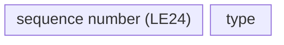
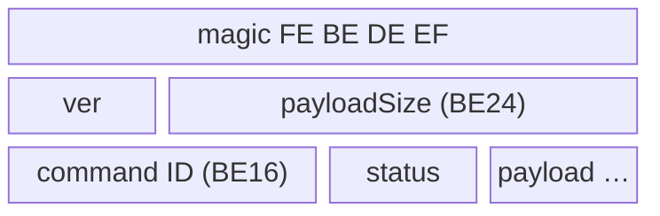
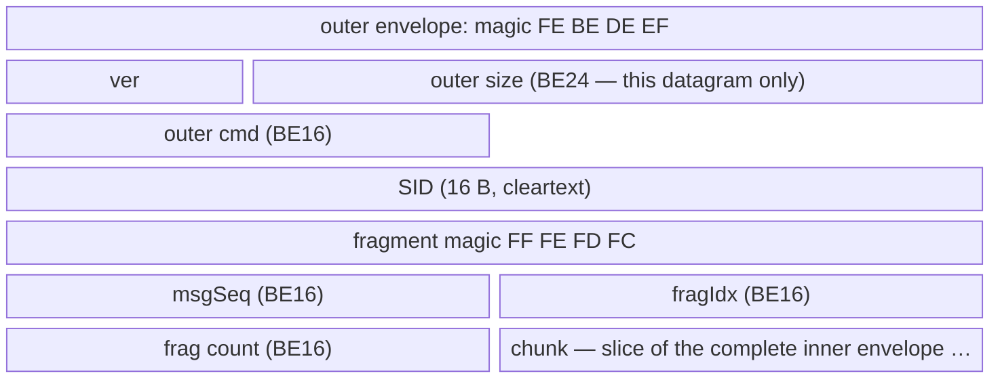
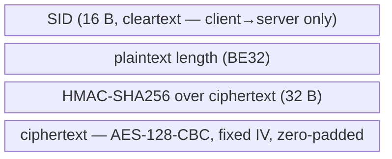
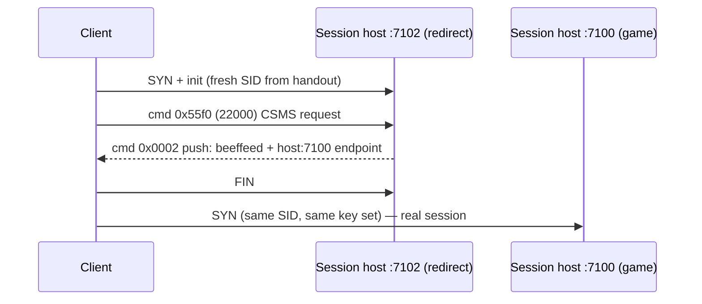

# Diarkis UDP/RUDP wire protocol

> [!IMPORTANT]
> 2026-09-18: the matchmaking captures are now decrypted end-to-end with a TLS
> keylog captured alongside the traffic — HTTPS API bodies and the Diarkis UDP
> sessions (both the matchmaking server and the session host). The earlier
> conclusion that historic captures are undecryptable is superseded for every
> capture the keylog covers. The four `udp 7100 data*.pcapng` files contain no
> TLS and remain undecryptable. Command payload sections below contain decoded
> facts.

The Diarkis protocol carries DBTB matchmaking and in-match coordination over
UDP on port 7100 (plus a port-7102 redirect service on session hosts), using
the endpoint and key material returned by
[battle/get_diarkis_matching_server_info](../API/battle/get_diarkis_matching_server_info.md#subsec:api_battle_get_diarkis_matching_server_info)
or `battle/get_connection_server_info`.

Facts below are confirmed against a fully decrypted matchmaking capture
(2026-09-18) and the 2026-09-16 structural census of the `udp 7100 data*.pcapng`
captures. Frame numbers refer to the matchmaking capture unless noted.

## Datagram header

Every RUDP datagram starts with a 4-byte header:

| offset | size | field | notes |
|---|---|---|---|
| 0..2 | 3 | sequence number | little-endian; wraps at 255 -> 256 |
| 3 | 1 | datagram type | see table below |



**Confirmed.** Sequence bytes advance as `00 00 00`, `01 00 00`, `02 00 00`,
... and wrap `ff 00 00` -> `00 01 00` at 255 -> 256. Each direction numbers
its DATs independently from 0.

Types (confirmed by observation except where noted):

| type | name | observed role |
|---|---|---|
| 1 | UNRELIABLE | in-match data and P2P signaling, no ACK; carries the same command envelope as DAT (dominates match traffic) |
| 2 | SYN | session open, 20 B: header + 16-byte session ID |
| 3 | DAT | reliable data, carries a command envelope |
| 4 | ACK | see below |
| 5 | RETRANSMIT | re-send of an unacked DAT (NOT a connection reset) |
| 6 | EACK | TODO (never observed) |
| 7 | FIN | teardown, 20 B: header + 16-byte session ID |

ACK formats — **confirmed**, asymmetric by side:

- Server ACKs are always bare 4 bytes: `<3-byte seq><04>` echoing the acked
  DAT's sequence. The SYN is answered with `00000004`.
- Client ACKs are N 20-byte records (N = 1..17 observed), each record
  `<3-byte seq><04><16-byte session ID>`. "Batched" ACKs are concatenated
  records, each with its own 4-byte header (e.g. a 40 B datagram acks two
  sequences — frame 9020).

Retransmission — **confirmed**: type 5 carries the original command envelope
of an unacked DAT (original sequence number, identical payload) and is sent
every 0.5 s. The udpstream.txt label "5 - retry" was correct; the earlier
"RST" interpretation was wrong.

FIN / teardown — **confirmed**: the FIN's sequence field carries the sender's
*next* DAT sequence (last DAT seq + 1), and the answering bare ACK carries the
*answerer's* next DAT sequence. If a client DAT is still unacked when the FIN
arrives, the server acks it separately first, then the FIN.

The 5×-burst duplication seen in captures is specific to the 0c0c directory
protocol (below) — RUDP DATs are NOT multi-blasted; reliability is via
type-5 retransmission (some capture files additionally contain interface-level
duplicate frames, which are not protocol behavior).

## Command envelope

Type-1, type-3 (and type-5) datagram bodies carry a command envelope:

| offset | size | field | notes |
|---|---|---|---|
| 0..3 | 4 | magic | `FE BE DE EF` |
| 4 | 1 | version | 0 or 1 observed |
| 5..7 | 3 | payloadSize | big-endian; counts the payload only |
| 8..9 | 2 | command ID | big-endian |
| 10 | 1 | status | **server->client only** — 01 OK / 04 BAD / ff push |
| 11 (10).. | payloadSize | payload | starts at byte 11 s->c, byte 10 c->s |



**Confirmed.** Client headers are 10 B, server headers 11 B; payloadSize counts
the payload after the header (excluding the status byte). Status values
observed: `01` = OK, `04` = BAD (once, cmd 0x000b response), `ff` =
push/asynchronous (very common; no request being answered). `05` = ERR never
observed.

Maximum envelope payload is ~1300 B per datagram; larger messages are
fragmented. **Confirmed** fragment layouts, one per direction.

Server->client — the whole datagram body is a fragment header + chunk:

| offset | size | field | notes |
|---|---|---|---|
| 0..3 | 4 | fragment magic | `FF FE FD FC` |
| 4..5 | 2 | msgSeq (BE16) | packed with fragIdx in one big-endian u32 |
| 6..7 | 2 | fragIdx (BE16) | see msgSeq |
| 8..9 | 2 | fragment count | big-endian |
| 10.. | n | chunk | slice of the complete command envelope |

Client->server — fragments are wrapped in an outer envelope whose size covers
**this datagram only**; the outer payload is:

| offset | size | field | notes |
|---|---|---|---|
| 0..15 | 16 | SID | cleartext |
| 16..19 | 4 | fragment magic | `FF FE FD FC` |
| 20..21 | 2 | msgSeq (BE16) | packed with fragIdx in one big-endian u32 |
| 22..23 | 2 | fragIdx (BE16) | see msgSeq |
| 24..25 | 2 | fragment count | big-endian |
| 26.. | n | chunk | slice of the complete inner envelope |



(Schematic — row widths are not byte-proportional; exact offsets in the
tables above.)

Concatenating chunks in index order reassembles a complete inner command
envelope. **Verified end-to-end** on both directions: client frames
8816/8817 (inner cmd 0x2ee0, inner payloadSize 1492, decrypts and
HMAC-validates) and 14 server fragment groups (up to 3716 B, msgSeq 0..13),
all in the matchmaking session below.

## Crypto envelope

The command-envelope payload is a crypto envelope:

| offset c->s | offset s->c | size | field |
|---|---|---|---|
| 0..15 | — | 16 | SID (cleartext; server->client has no SID prefix) |
| 16..19 | 0..3 | 4 | plaintext length, big-endian (excludes padding) |
| 20..51 | 4..35 | 32 | HMAC-SHA256 over the **ciphertext only** |
| 52.. | 36.. | n | ciphertext = AES-128-CBC(aes_key, fixed IV, zero-pad(plaintext)) |



(Schematic — row widths are not byte-proportional; exact offsets in the
table above.)

**Confirmed by full-session decryption** (2026-09-18): every encrypted packet
in both matchmaking-server and session-host sessions HMAC-validates and
decrypts to structured plaintext (402-line and 2475-line golden transcripts;
see Golden transcripts).

- Fixed key and fixed 16-byte IV per session; **no per-packet IV**
  (decrypting with the session IV yields valid content from byte 0; a wrong IV
  corrupts only block 1 — the classic CBC signature). `RUDPserver.py`'s
  decryptData, which treats bytes 32:48 as a per-packet IV, is wrong; do not
  copy it.
- Padding: zero bytes, always 1..16 of them — ciphertext length is always
  `16 * (len//16 + 1)`, i.e. a full extra block when already aligned
  (len=0 -> 16 B ct; len=53 -> 64 B ct). The 4-byte length excludes padding.
- The 16-byte cleartext SID prefix appears on client->server packets only and
  always equals the session ID from the type-2 SYN.
- ver=1 commands with empty payload (e.g. cmd 0x0131 at bootstrap) carry
  length field 0 with a 16-byte ct block whose decrypted content is
  structurally zero/insignificant.

### Key roles

**Confirmed positionally** from decrypted `get_diarkis_matching_server_info`
responses paired with their UDP sessions (same capture, matched by
reversed-IP hostname + timestamp):

| response array position | wire role |
|---|---|
| `[1][0]` | endpoint hostname (reversed-IP `.bc.googleusercontent.com`) |
| `[1][1]` | UDP port (7100 matchmaking / 7102 session-host redirect) |
| `[1][2]` | 16-byte session ID (SID): body of the type-2 SYN; prepended cleartext to every client->server DAT; echoed in client ACK records |
| `[1][3]` | AES-128-CBC key |
| `[1][4]` | AES-128-CBC IV (fixed) |
| `[1][5]` | HMAC-SHA256 key, over ciphertext only |

The leading `0` in the response data array and the `[1, 1]` tail are constants
across six decrypted responses (meaning still unknown).
`get_connection_server_info` uses the same layout minus the `[1, 1]` tail.

unpackmsg.py's labels are swapped: its `udpIV` is the SID and its `sid` is the
AES IV (`udpKey`/`hashKey` were already correct).

### Key rotation

**Confirmed: keys are per-session random.** Five
`get_diarkis_matching_server_info` responses in one matchmaking capture each
carry a fresh four-value set, and each new UDP session SYNs with the matching
fresh SID. Consequence for the custom server: the HTTP endpoint must generate
each key set at runtime and share it with the UDP server process.

Coverage: sessions in the matchmaking and gameplay captures taken with SSLKEYLOGFILE
enabled are decryptable; the four `udp 7100 data*.pcapng` files contain no TLS
handshakes, so their sessions remain undecryptable unless their keys surface
elsewhere.

## Session bootstrap

**Confirmed** by full decryption (matchmaking server session, frames
4685-4905, client `192.168.1.10:61805` -> `34.71.237.11:7100`; placeholder
client address — see note under Golden transcripts):

1. C->S SYN (type 2, 20 B): `00000002` + 16-byte fresh random SID.
2. S->C bare ACK: `00000004`.
3. C->S init DAT, cmd 0x0001 ver 0. Decrypted plaintext (53 B):

   ```text
   [4-byte token][a0 01 00 00]            8-byte prefix (token varies per packet; a0010000 constant)
   u32be(19) "203.0.113.100:61805"        STUN/public address (ASCII; doc placeholder)
   u32be(18) "192.168.1.10:61805"         LAN address (ASCII; doc placeholder)
   ```

4. C->S cmd 0x0131 ver 1 (P2P NAT-check), empty plaintext (length field 0).
5. S->C init answer, cmd 0x0001 ver 0 status 1; 26-byte plaintext:
   `01` + the 4-byte token echoed + `a0 01 00 00` + the client's
   **server-observed** public address as unprefixed ASCII
   (`"198.51.100.7:61805"` placeholder — note this differs from the client's
   STUN claim; the server reports what it actually sees).
6. S->C cmd 0x0131 ver 1 status 1, 1-byte plaintext `02`.
7. S->C two cmd 0x012f pushes (status ff): ASCII endpoint strings,
   `3.102.71.34.bc.googleusercontent.com:7100` and the same host on `:7099`
   (43-byte plaintexts = u16 length + ASCII).
8. C->S cmd 0x0130 ver 1 (empty plaintext) — bootstrap complete; the session
   then carries matchmaking traffic (cmd 0x2ee0) and heartbeats.


## Session-host redirect service (port 7102)

**Confirmed** (frames 18096-18110). `get_connection_server_info` hands out the
session host on **port 7102**; that port runs a redirect probe, not the game
session:

1. C->S SYN + init (same bootstrap as above, fresh SID from the handout).
2. C->S cmd 0x55f0 (22000) ver 1 — CSMS-framed request (see MatchMaker).
3. S->C cmd 0x0002 ver 0 status ff, 49-byte plaintext:
   `be ef fe ed` + ASCII `"249.110.148.146.bc.googleusercontent.com:7100"`.
4. Client FINs the 7102 probe and immediately SYNs the same host on **7100**
   (same SID — the key set carries over) — the real session.



## 0c0c directory service

**Confirmed**: a separate lightweight cleartext protocol on the same port —
these packets have NO RUDP datagram header and are NOT encrypted (frames
4828-4876):

```text
query (C->S, 26 B):   0000 0c0c 00000001 0010 <16-byte session SID>
answer (S->C, 51 B):  0f0f 0c0c 00000001 0029 "3.102.71.34.bc.googleusercontent.com:7100"

[0..1]  flag: 0000 or 0f0f
[2..3]  command: 0x0c0c (directory)
[4..7]  constant 00000001
[8..9]  payload length, 2-byte big-endian
[10..]  payload: SID (query) / ASCII "<reversed-ip>.bc.googleusercontent.com:7100" (answer)
```

Both sides transmit in **5× identical bursts**; rounds repeat on a ~1.0 s
cadence. The flag flips after the first exchange (client `0000` -> `0f0f`,
server `0f0f` -> `0000`). Flag semantics: TODO. The directory answer and the
cmd 0x012f pushes steer the client to the same peer host. The client probes
every candidate server while holding a full RUDP session with its chosen one.

## Heartbeat and teardown

**Confirmed** on the decrypted matchmaking session (see Golden transcripts):

- Heartbeat is the cmd 0x0001 ver 0 pair on the established session, every
  ~5.0 s (measured 4.9-5.1 s over 30+ beats): client plaintext is 8 B —
  a 4-byte counter (increments every beat) + `a0 01 00 00`; server replies
  with 26 B — `01` + the counter echoed + `a0 01 00 00` + the observed
  public address (same shape as the init answer).
- While queued, the server additionally pushes cmd 0x00db (219) ver 1
  status ff every ~5 s, payload the ASCII string `"Timeout"` (7 B).
- Teardown: client FIN (type 7, 20 B) -> server bare ACK; sequence
  relationship documented under Datagram header.

## MatchMaker commands

**Partially confirmed** (2026-09-18 decryption; M4 continues per-command
detail). DBTB matchmaking rides **custom command 12000 (0x2ee0)**, not the
public Diarkis ticket flow (218-229 were not observed except 219 "Timeout"
pushes). Payload framing on both directions:

```text
"CSMS09.01"                          version string (client); server pushes use "CSMS" + u16 + ".01" variant
5 B zeros
18-digit ASCII user ID               (server pushes pad to 20 chars with leading 0)
16 B zeros
u32be                                inner payload length
u16be                                sub-ID (see below)
msgpack map
```

- Client->server msgpack: `{title_cd, platform, user_id, id, data}` where `id`
  repeats the sub-ID and `data` is a **JSON string**. Observed sub-IDs:
  - 12014 — ticket create/search: `{"desiredRole":20,"desiredStageId":"unselected"}`
  - 12005 — join room: `{"roomId":"<roomId>","userId":...,"userData":"{}","sdpData":"{...player_level,p2p_uid,pf_uid(SteamID),patroller_name,account_name,able_rematch...}"}`
  - 12017 — leave room: `{"roomId":"..."}`
- Server->client: msgpack `{id, data}`; status-01 answers carry
  `{"status":0,...}`; status-ff pushes carry roomId / battleRoomId /
  roomMember roster JSON (up to ~3.7 KB, fragmented). Sub-IDs 12101+ observed
  (e.g. 0x2f45, 0x2f46, 0x2f58).
- cmd 0x00db (219): MatchMaker push, payload ASCII `"Timeout"` — while queued.

The full byte-level census per sub-ID is M4 (see Golden transcripts).

## Room commands

**Partially confirmed** on the session host (see Golden transcripts):

- cmd 0x0065 (101): create/join response — 56 B plaintext carrying a 32-char
  hex room/session GUID.
- cmd 0x0067 (103), 0x0068 (104): pushes (status ff) with per-member records —
  16-byte binary member/session IDs (`c7b169112d509e0047461900...` style).
- cmd 0x55f0 (22000): the second custom command — CSMS-framed like 12000;
  responses/pushes carry `{"status":0,"diarkisRoomId":...}` and roomMember
  JSON. Used on both the 7102 redirect probe and the session host.

## P2P

**Partially confirmed** (session host):

- Bootstrap NAT probes on the matchmaking session: cmd 0x0131 (305) empty
  request -> 1-byte `02` answer; cmd 0x0130 (304) empty; cmd 0x012f (303)
  pushes carry ASCII endpoints.
- cmd 0x007f (127) push, 784 B plaintext: the P2P init/mesh description —
  sequence of 18-digit ASCII player IDs plus opaque per-peer blobs.
- cmd 0x012d (301) client->server: 16 zero bytes, sent once per peer
  (8 observed in a row) — P2P-established reports.
- The in-match real-time channel is **type-1 (unreliable)** datagrams with
  standard envelopes: cmd 0x0013 (19) and 0x0018 (24), plaintexts keyed by
  18-digit ASCII player IDs — per-player updates routed through the session
  host (25 B server->client per player; 104 B client->server).

## Match-found burst

**Confirmed** (decrypted): while queued, the server pushes cmd 0x2ee0 with
`roomId` JSON; on match found it pushes `battleRoomId` (`"Z6Vi..."`) and the
full roster/match parameters (fragmented, up to 3.7 KB), interleaved with cmd
0x00db Timeout pushes. The client then calls
`battle/get_connection_server_info` over HTTPS and is steered to the session
host via the port-7102 redirect service (above).

## Golden transcripts

Annotated, frame-referenced decryption transcripts exist for each flow —
bootstrap, the `0c0c` directory exchange, heartbeat, teardown, the full
matchmaking-server session (UDP stream 43, frames 4685-18418) and the full
session-host traffic (streams 162/163, frames 18096-end). They are **not in
this repository**: the raw transcripts contain real player IDs and network
addresses. They are kept in the project's private evidence vault and shared
with collaborators on request. All protocol facts above are reproduced from
them, and the frame numbers cited throughout refer to the same capture.

A small standalone decoder reproduces the transcripts from a tshark TSV export
plus the four handout values (SID, AES key, IV, HMAC key); it lives in the
private tooling repository for the same reason.

Example addresses in this document (`192.168.1.10`, `203.0.113.100`,
`198.51.100.7`) are RFC 1918 / RFC 5737 documentation placeholders substituted
for the real captured addresses.

---

[Back to document map](../README.md)
